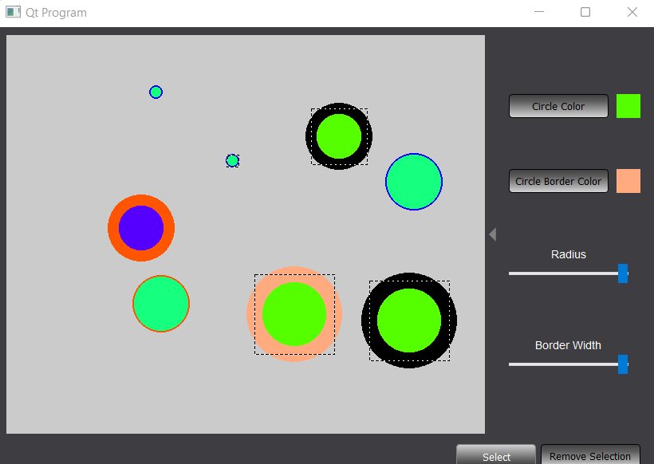

# Arteris-IP-Qt-Problem

## Interview application for Arteris IP

## Requirements
Create an application with Qt or PyQt which allows the following:
- create circles with a simple click
- edit the color of existing circles in real time
- edit any other properties you think would be useful
- remove multiple circles at once
- bonus points for being able to edit the properties of multiple circles at once

## GUI

